# testeranto

## The AI-powered BDD test framework for TypeScript projects

🚧 WARNING: Testeranto is still under development and is not ready for production yet. 🚧

demo video: [youtube](https://www.youtube.com/embed/WvU5xMqGi6Q)

source: [github.com/adamwong246/testeranto](https://github.com/adamwong246/testeranto)

npm: [npmjs.com/package/testeranto](https://www.npmjs.com/package/testeranto)

dev: [github.dev/adamwong246/testeranto](https://github.dev/adamwong246/testeranto)

example repo: [testeranto-starter](https://github.com/adamwong246/testeranto-starter)

## What is testeranto?

- Testeranto produces test results which can be fed to Aider.ai to automatically fix failing tests.
- Testeranto tests are specified in a strongly-typed gherkin-like syntax. Rather than testing your code directly, Testeranto requires you wrap your code with a semantic interface which is based on TS type signatures.
- Testeranto can be run in the frontend or the backend, or both.
- Testeranto can be used to test anything that can be bundled with esbuild.
- Testeranto connects "features" to "tests". This allows the AI to read feature documentation from external systems, like Jira.
- Testeranto generates test results into static a website which can be deployed to github pages easily.

## Key Technologies

Testeranto builds on modern JavaScript/TypeScript tooling:

| Technology | Purpose                                |
| ---------- | -------------------------------------- |
| TypeScript | Strongly-typed test definitions        |
| Puppeteer  | Cross-runtime testing (Node & Browser) |
| esbuild    | Fast test bundling                     |
| Aider.ai   | AI-powered test fixing                 |
| ESLint     | Static analysis of test files          |
| tsc        | Type checking of test files            |
| Markdown   | Feature documentation format           |

## Quick Start

1. Install testeranto:

```bash
npm install testeranto
```

2. Create a test file (e.g., `rectangle.test.ts`):

```typescript
import { Given, When, Then } from "testeranto";

type Rectangle = { width: number; height: number };

const RectangleSpec = (Suite, Given, When, Then) => [
  Suite.Default("Rectangle tests", {
    test1: Given.Default(
      ["Basic rectangle operations"],
      [When.setWidth(5), When.setHeight(10)],
      [Then.getWidth(5), Then.getHeight(10)]
    ),
  }),
];
```

3. Run your tests in two separate terminals:

```bash
# Terminal 1 - Build in watch mode
yarn t-build rectangle.test.ts dev

# Terminal 2 - Run in watch mode
yarn t-run rectangle.test.ts dev
```

### Development Workflow

```mermaid




flowchart LR

    subgraph hh["humans"]
        direction LR
        Human[🧑💻 ]
    end

    subgraph bb["AI"]
        direction LR
        Bot[🤖🧠 aider]
    end


    tests ---> L
    subgraph tests
        direction LR
        A[Test Specification]
        B[Test Interface]
        C[Test Implementation]
        K[application code]
    end

    subgraph buildSystem
        direction TB
        L["t-build"]
        M[t-run]
        L ---> M

        M ---> N
        M --->O
        M --->P
        N["BDD tests"]
        O["Static analysis"]
        P["Type checking"]

        Q["reports"]
        N ---> Q
        O ---> Q
        P ---> Q



    end

    Q ---> bb

    buildSystem ---> bb
    bb ---> tests
    hh ---> tests






    %% Styling
    style Human fill:#268bd2,stroke:#586e75,color:#fdf6e3
    style Bot fill:#d33682,stroke:#586e75,color:#fdf6e3

    %% Layout tweaks
    classDef column margin-right:20px

```



## Architecture Overview


## Runtime Platforms

Testeranto runs tests in multiple runtime environments, each suited for different testing scenarios:

| Runtime  | Description                                       | When To Use                                                            | Key Characteristics                                     |
| -------- | ------------------------------------------------- | ---------------------------------------------------------------------- | ------------------------------------------------------- |
| **Node** | Full IO access with Node.js built-in modules      | Testing backend code, Node APIs, or anything needing filesystem access | Runs in Node v8 via fork, has access to fs, crypto, etc |
| **Web**  | DOM API access with browser capabilities          | Testing frontend code, UI interactions, or visual regression           | Runs in Chrome page, can take screenshots/recordings    |
| **Pure** | Isolated JS runtime without external dependencies | Fast unit tests that don't need external resources                     | Dynamically imported into main thread, no IO access     |

**Key Considerations:**

- Use **Node** for testing backend services, file operations, or anything requiring Node.js APIs
- Use **Web** when testing browser-specific code that references `document` or `window`
- Use **Pure** for fast, isolated unit tests where you don't need console output or external resources

## CLI Commands

| Command                               | Description                                   |
| ------------------------------------- | --------------------------------------------- |
| `yarn t-init`                         | Create a new testeranto project               |
| `yarn t-build <YOUR_TESTS> dev\|once` | Build test bundles (watch or single-run mode) |
| `yarn t-run <YOUR_TESTS> dev\|once`   | Run tests (watch or single-run mode)          |
| `yarn t-report`                       | Launch test report server                     |
| `yarn t-aider`                        | Fix failing tests with AI                     |

Example workflow:

```bash
# Initialize project
yarn t-init

# Write tests in test/*.test.ts

# In terminal 1 - Build tests (watch mode)
yarn t-build test/rectangle.test.ts dev

# In terminal 2 - Run tests (watch mode)
yarn t-run test/rectangle.test.ts dev

# Or for single-run mode:
yarn t-build test/rectangle.test.ts once
yarn t-run test/rectangle.test.ts once

# Get AI help with failures
yarn t-aider
```

## AI

Testeranto generates a "prompt" alongside test results. This prompt is passed to aider as input.

```
// input src files which can be edited by aider
/add test/node.ts

// test report files that inform aider but should not be edited
/read testeranto/reports/allTests/node/test/node/tests.json
/read testeranto/reports/allTests/test/node/node/lint_errors.json
/read testeranto/reports/allTests/test/node/node/type_errors.txt

// A list of features which can inform aider.
/load testeranto/reports/allTests/node/test/node/featurePrompt.txt

// tell the AI what to do
/code Fix the failing tests described in testeranto/reports/allTests/node/test/node/tests.json. Correct any type signature errors described in the files testeranto/reports/allTests/test/node/node/type_errors.txt. Implement any method which throws "Function not implemented. Resolve the lint errors described in testeranto/reports/allTests/test/node/node/lint_errors.json"
```

## "Features"

Testeranto connects "features" to tests. The features may be simple strings, but they can also take the form of local markdown files, or remote URLs to external feature tracking systems. For instance, this could be a jira ticket or a github issue. These features are used to inform the AI context.

```ts
import someMarkdownFile from "someMarkdownFile.md";

...

test0: Given.Default(
  [
    "https://api.github.com/repos/adamwong246/testeranto/issues/8",
    "you can set the width and height of a Rectangle",
    someMarkdownFile
    ],

  [When.setWidth(4), When.setHeight(19)],
  [Then.getWidth(4), Then.getHeight(19)]
),
...

```

## Sidecars (COMING SOON)

Along side your test, you can include a number of "sidecars" which are other bundled javascript assets upon which your test depends. For example, suppose you have an app with a frontend and backend component. You could run a react test in the web and include the node http server as a sidecar.

## `eslint` and `tsc`

Alongside the bdd tests, testeranto runs eslint and tsc upon the input files to generate a list of static analysis errors and a list of type errors, respectively.

## Subprojects

Testeranto has a core repo, but there are also subprojects which implement tests by type and by technology

### testeranto-solidity

Test a solidity contract. Also included is an example of deploying a contrct to a ganache server.

### testeranto-reduxtoolkit

Test a redux store.

### testeranto-http

Test a node http server.

### testeranto-react (COMING SOON)

Test a react component. You can choose from a variety of types (jsx functions, class style, etc) and you can test with `react`, `react-dom`, or `react-test-renderer`

### testeranto-express (COMING SOON)

### testeranto-xstate (COMING SOON)
