# Git Integration Initiative Plan

## Overview

This document outlines the plan to integrate Git functionality into Testeranto, enabling multiple operational modes and providing a simplified Git interface for non-coders.

## Modes of Operation

### 1. Static Mode (Read-only)

- **Purpose**: View test results and reports without modification capabilities
- **Features**:
  - Read from local files only
  - No write operations
  - Aider cannot be run
  - No server component
- **Use Cases**:
  - Reviewing test results
  - Demonstrating functionality
  - Read-only analysis

### 2. Development Mode (Read-write)

- **Purpose**: Full local development and testing capabilities
- **Features**:
  - Full read/write access to local files
  - Aider runs locally
  - Server component active
  - Full testing capabilities
- **Use Cases**:
  - Local development
  - Test creation and modification
  - AI-assisted test fixing

### 3. Git Remote Mode (Git-based read/write)

- **Purpose**: Collaborate via Git without local file modifications
- **Features**:
  - Read/write via Git to remote repositories
  - Cannot run Aider (requires local file access)
  - No server component
  - Git operations through a client
- **Use Cases**:
  - Team collaboration
  - Code review workflows
  - Remote repository management

## Simplified Git Experience Design

### Core Philosophy: Git Made Gentle

Focus on the essential workflow that beginners need:

1. **Save Changes**: Commit with meaningful messages
2. **Share Work**: Push to remote repository
3. **Get Updates**: Pull latest changes
4. **Resolve Conflicts**: Simple visual tools when needed

### Key Simplifications

#### 1. Unified "Save & Share" Operation

Combine staging, committing, and pushing into a single intuitive action:

- Auto-stage all changes when user wants to save
- Generate commit messages based on file changes
- Option to push immediately or save locally first

#### 2. Smart Branch Management

- Hide complex branching by default
- Auto-create feature branches when needed
- Simple branch switcher with visual indicators

#### 3. Visual Status Indicators

- Color-coded file status (modified, staged, unchanged)
- Simple icons instead of technical terms
- Progress indicators for ongoing operations

#### 4. Conflict Resolution Made Simple

- Visual side-by-side comparison
- "Use My Changes" / "Use Their Changes" buttons
- Guided resolution process

### Git Library Selection

**Use isomorphic-git** for its browser compatibility, but wrap it with a simplified API:

```typescript
interface SimpleGitClient {
  // Core operations
  saveChanges(message?: string): Promise<void>;
  shareChanges(): Promise<void>;
  getUpdates(): Promise<void>;

  // Status
  getChanges(): Promise<FileChange[]>;
  getHistory(): Promise<Commit[]>;

  // Conflict resolution
  hasConflicts(): Promise<boolean>;
  resolveConflicts(resolutions: ConflictResolution[]): Promise<void>;
}

interface FileChange {
  path: string;
  status: "modified" | "added" | "deleted";
  preview?: string;
}

interface ConflictResolution {
  path: string;
  resolution: "mine" | "theirs" | "custom";
  content?: string;
}
```

### Beginner-Friendly Terminology

| Technical Term | Friendly Alternative |
| -------------- | -------------------- |
| Commit         | Save Changes         |
| Push           | Share                |
| Pull           | Get Updates          |
| Branch         | Workspace            |
| Merge          | Combine Changes      |
| Staging        | (Hidden)             |

### UI Flow Inspired by GitHub Desktop

1. **Changes View**: Visual list of modified files with checkboxes
2. **Summary Box**: Auto-generated commit message suggestions
3. **Action Buttons**: "Save to Computer" and "Save & Share"
4. **History Panel**: Visual timeline of saves
5. **Sync Status**: Clear indicator of local vs remote state

### Implementation Strategy

1. Start with local repository operations only (no cloning support needed)
2. Focus on the core save/share/update workflow
3. Add conflict resolution as a secondary feature
4. Use visual metaphors instead of technical terms
5. Provide helpful tooltips and guided tours

### Error Handling

- Friendly error messages with suggested actions
- Visual indicators for network issues
- Recovery options for common problems
- Undo capabilities where possible

## Implementation Phases

### Phase 1: Foundation

1. Mode detection and configuration system
2. Integrate isomorphic-git library
3. File system abstraction design
4. Basic Git operations prototype (clone, status, commit)

### Phase 2: Core Functionality

1. Implement Static Mode
2. Enhance Development Mode with Git awareness
3. Build basic Git Remote Mode skeleton with conflict detection
4. Simple merge conflict visualization

### Phase 3: Advanced Features

1. Complete Git Remote Mode implementation
2. Simplified Git interface for non-coders
3. Integration with Aider workflow
4. Advanced merge conflict resolution tools

### Phase 4: Polish and Optimization

1. Performance improvements
2. Enhanced UI/UX
3. Security hardening (OAuth, credential management)
4. Comprehensive testing including conflict scenarios

## Technical Considerations

### Git Library Selection

- **Primary**: isomorphic-git for cross-platform compatibility
- **Storage**: IndexedDB for browser, filesystem for Node.js

### File System Abstraction

- Design unified interface for local and Git-based file operations
- Handle mode-specific limitations gracefully
- Implement efficient caching strategies
- Conflict-aware file operations

### User Interface

- Clear mode indicators
- Simplified Git operations interface
- Visual staging area
- Commit message templates
- One-click operations
- Conflict resolution visualization

## UI Strategy for Git Integration

### Learn from GitHub Desktop

GitHub Desktop provides an excellent reference for simplifying Git workflows. Let's analyze key patterns:

### GitHub Desktop UI Patterns to Adopt

1. **Changes View**: Visual list of modified files with checkboxes for staging
2. **Summary & Description**: Simple commit message input with description field
3. **Branch Management**: Visual branch switcher with current branch indicator
4. **Repository List**: Easy access to multiple repositories
5. **History View**: Timeline of commits with visual diff indicators
6. **Sync Status**: Clear indicators for ahead/behind remote status
7. **Conflict Resolution**: Guided merge conflict resolution workflow

### Implementation Approach

1. **VSCode Integration First**: Use `@vscode/webview-ui-toolkit` components when in VSCode context
2. **GitHub Desktop Inspiration**: Adopt GitHub Desktop's simplified workflows and terminology
3. **Monaco Editor**: Leverage Monaco for diff viewing and commit message editing
4. **Progressive Enhancement**: Start with core GitHub Desktop-like functionality
5. **Context Awareness**: Adapt UI based on whether we're in VSCode vs. standalone

### Key GitHub Desktop Features to Implement

1. **Visual File Status**: Color-coded indicators for modified/added/deleted files
2. **Simple Staging**: Checkbox interface for staging/unstaging changes
3. **Commit Flow**: Summary and description fields with character count
4. **Branch Visualization**: Current branch indicator with easy switching
5. **Sync Controls**: Push/pull buttons with status indicators
6. **Conflict Resolution**: Side-by-side diff with "Use Mine/Theirs" options

### Technical Integration

- Use Monaco's diff editor capabilities (already built-in)
- Adopt GitHub Desktop's mental model but with VSCode's visual language
- Ensure the interface works both in VSCode webview and standalone contexts
- Focus on the core "changes → commit → push/pull" workflow first

## Implementation Plan

### Phase 1: Centralized File Service & Core Setup (1.5 weeks)

1. **File Service Foundation**: Create the unified FileService interface
2. **Mode Implementations**: Build Static, Development, and Git mode implementations
3. **Service Integration**: Replace ad-hoc fetch calls with FileService throughout the app
4. **Git Setup**: Install isomorphic-git and create basic Git operations wrapper

### Phase 2: Git Integration & Basic UI (1.5 weeks)

1. **Changes Detection**: Implement file status monitoring via FileService
2. **Simple Save**: Create "Save Changes" with auto-generated messages
3. **Basic UI**: Build visual file status indicators using Bootstrap components
4. **Service Enhancement**: Add Git operations to FileService for Git Remote Mode

### Phase 3: Sync & Advanced Features (1 week)

1. **Share Function**: Implement push to remote repositories
2. **Update Function**: Implement pull from remote
3. **History Integration**: Add commit history to FileService
4. **Conflict Detection**: Basic conflict identification

### Phase 4: Polish & User Experience (1 week)

1. **Conflict Resolution**: Monaco diff editor integration
2. **Error Handling**: Friendly messages and recovery options
3. **Performance**: Optimize file operations and caching
4. **Tutorial**: Guided first-time experience

## UI Layout Design

### Main Git Interface Layout

```mermaid
flowchart TD
    subgraph MainLayout [Git Integration Interface]
        direction TB
        
        Header[Header / Toolbar]
        MainContent[Main Content Area]
        StatusBar[Status Bar]
        
        Header --> MainContent --> StatusBar
        
        subgraph MainContentArea [Main Content - 3 Column Layout]
            direction LR
            
            ChangesPanel[Changes Panel<br/>GitHub Desktop-style]
            DiffViewer[Diff Viewer<br/>Monaco Editor]
            CommitPanel[Commit Panel<br/>Summary & Description]
            
            ChangesPanel --> DiffViewer --> CommitPanel
        end
        
        subgraph ChangesPanelDetail [Changes Panel Details]
            direction TB
            CP1[Repository Selector]
            CP2[Branch Indicator & Switcher]
            CP3[File Status List<br/>- Modified files with checkboxes<br/>- Color-coded status indicators<br/>- File tree navigation]
        end
        
        subgraph DiffViewerDetail [Diff Viewer Details]
            direction TB
            DV1[Side-by-side diff view]
            DV2[Syntax highlighting]
            DV3[Line numbers]
            DV4[Conflict resolution tools]
        end
        
        subgraph CommitPanelDetail [Commit Panel Details]
            direction TB
            CM1[Summary field<br/>50-72 chars recommended]
            CM2[Description field<br/>Extended commit message]
            CM3[Character counter]
            CM4[Commit button group<br/>- Save to Computer<br/>- Save & Share]
        end
        
        subgraph StatusBarDetail [Status Bar Details]
            direction LR
            SB1[Sync Status Indicator<br/>Ahead/Behind remote]
            SB2[Mode Indicator<br/>Static/Dev/Git]
            SB3[Progress Indicators]
        end
    end
```



### Responsive Layout Considerations

For smaller screens, the 3-column layout will collapse to a tabbed interface:
1. **Changes Tab**: File status and staging
2. **Diff Tab**: Code changes visualization  
3. **Commit Tab**: Message input and actions

### Component Hierarchy

```
GitIntegrationView
├── HeaderToolbar
│   ├── RepositorySelector
│   ├── BranchSwitcher
│   └── ModeIndicator
├── MainContent
│   ├── ChangesPanel (left)
│   │   ├── FileTree
│   │   └── FileStatusList
│   ├── DiffViewer (center)
│   │   └── MonacoDiffEditor
│   └── CommitPanel (right)
│       ├── SummaryInput
│       ├── DescriptionTextarea
│       └── ActionButtons
└── StatusBar
    ├── SyncStatus
    ├── ProgressIndicator
    └── ErrorNotifications
```

### Visual Design Principles

1. **GitHub Desktop Inspiration**: Follow their proven layout patterns
2. **VSCode Integration**: Use @vscode/webview-ui-toolkit components when appropriate
3. **Progressive Disclosure**: Show advanced options only when needed
4. **Clear Visual Hierarchy**: Important actions should be most prominent
5. **Consistent Spacing**: Use VSCode's spacing standards (8px multiples)

## Next Steps

1. **Install Dependencies**:
   ```bash
   npm install isomorphic-git
   npm install @vscode/webview-ui-toolkit
   npm install @vscode/codicons
   ```
2. **Study GitHub Desktop**: Analyze its UI patterns and workflows
3. **Create FileService Interface**: Define the unified file operation API
4. **Implement Mode-Specific Services**:
   - StaticFileService (read-only)
   - DevelopmentFileService (full FS access)
   - GitFileService (isomorphic-git based)
5. **Build GitHub Desktop-inspired UI**:
   - Changes panel with file status and staging checkboxes
   - Commit message interface (summary + description)
   - Branch indicator and switcher
   - Push/pull buttons with sync status
6. **VSCode Integration**: Use webview components when in VSCode context
7. **Refactor File Access**: Update components to use FileService instead of ad-hoc fetches
8. **Error Handling**: GitHub Desktop-style error messages and recovery
9. **Loading States**: Visual feedback for Git operations
